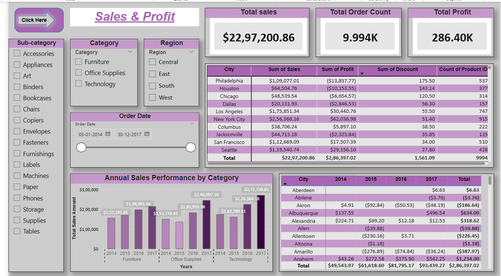
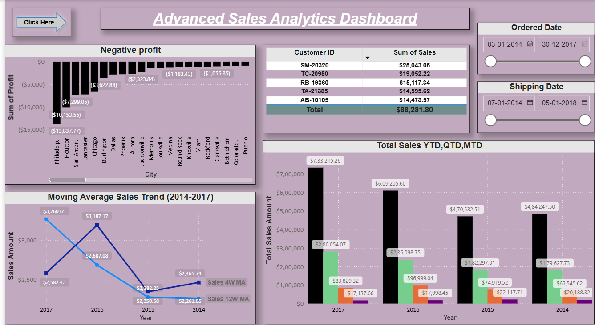
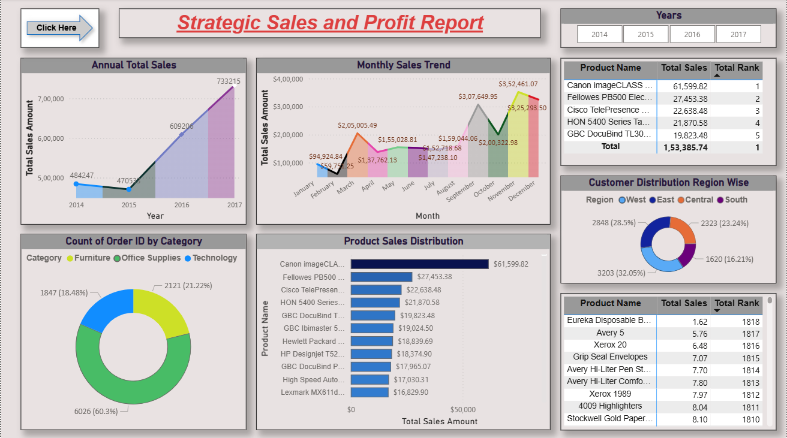
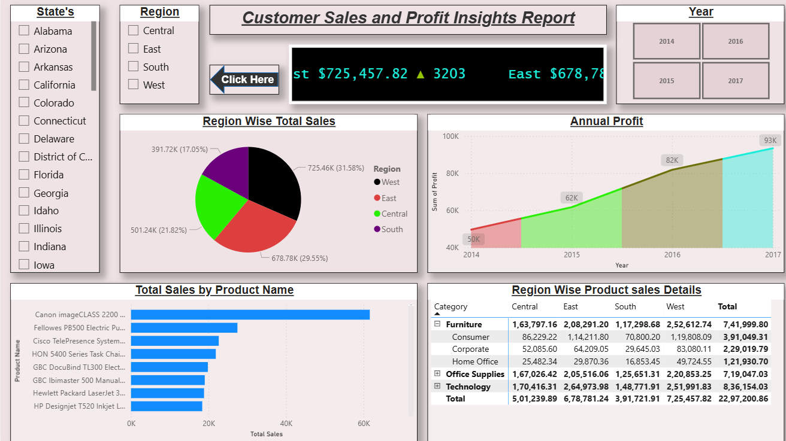

# Sales & Profit Analysis Dashboard

## Overview

This Power BI dashboard provides a comprehensive analysis of sales and profit performance. It enables business users to monitor KPIs, identify trends, analyze customer behavior, and make data-driven decisions.

---

## Dashboard Features

- Total Sales
- Total Profit
- Total Orders
- Sales by Category
- Profit by City
- Top 5 Customers
- YTD, QTD, MTD & WTD Sales
- Negative Profit Analysis
- 4-Week & 12-Week Moving Average
- Interactive Filters and Slicers

---

## Tools Used

- Power BI Desktop
- Power Query
- DAX
- Data Modeling

---

## Dashboard Preview

### Report 1

### Report 2

### Report 3

### Report 4

---

## Project File
**Sales-Profit-Analysis-Dashboard.pbix**

---

## Author
**Yogaraj M**

Data Analyst | SQL | Power BI | Python | Excel
